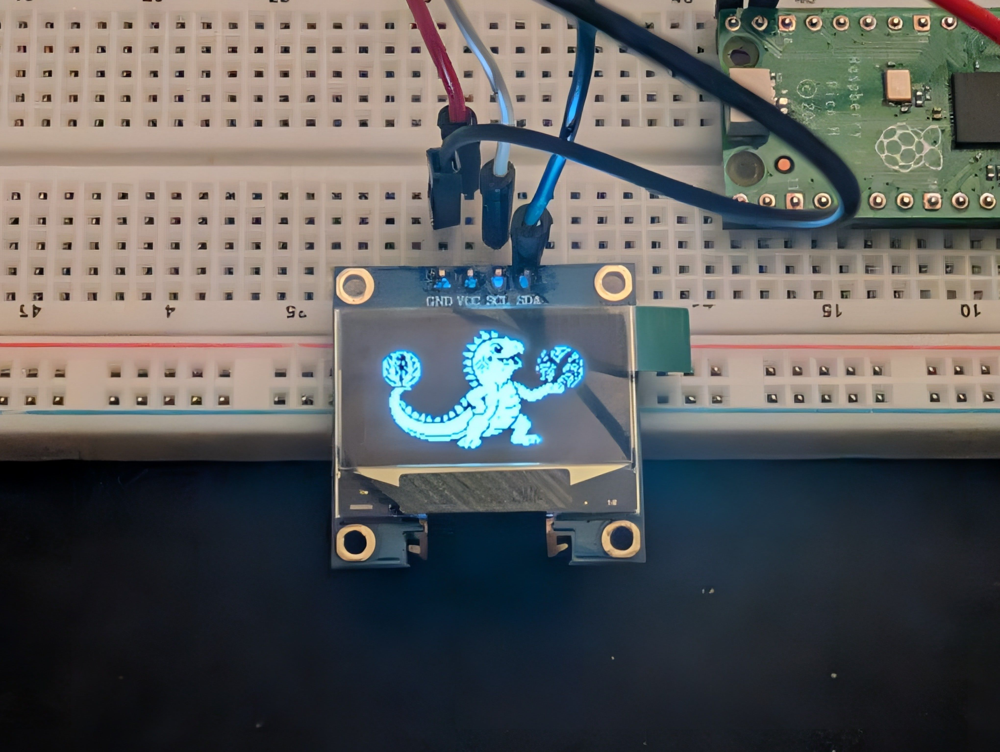

# SSD1306 OLED Example using MicroZig

A small MicroZig example for driving an SSD1306 OLED display with a Raspberry Pico (RP2040).

So my question was: "How to draw a pixel on the screen?"

This example demonstrates that by displaying a picture.

I also included my own `FrameBuffer` implementation, which I used to learn how the SSD1306 framebuffer and page layout work.
There are two common ways to pack 1-bit pixels into bytes: horizontal bit packing and vertical bit packing. The SSD1306 uses vertical bit packing, where one byte represents 8 vertical pixels within a page. 
My `FrameBuffer` implementation supports both, but it is mainly included for learing purposes.



## Hardware

- Breadboard
- Raspberry Pi Pico (RP2040)
- SSD1306 OLED display

### Wiring

- OLED SDA -> GPIO19
- OLED SCL -> GPIO20
- OLED VCC -> 3V3
- OLED Gnd -> Gnd

## Requirements
- Zig - lastest main version
- `picocom` for serial logging

You could also use Nix to setup your dev environment:

```sh
nix develop
```

## Build and Flash

```sh
zig build
```

Flash the generated UF2 file:

```text
./zig-out/firmware/ssd1306-example.uf2
```

## Serial Logging using Raspberry Pi Debug Probe
Requires `picocom`.

- Connect Debug Probe `U`:
  - yellow (RX) → Pico GPIO0 (TX)
  - black (GND) → Pico GND
- Find port: `ls /dev/cu.usbmodem*`
- Open: `picocom -b 115200 /dev/cu.usbmodem*`; the device name may differ
- Open in Neovim: `:terminal picocom -b 115200 /dev/cu.usbmodem141402`
- Exit: `Ctrl-A`, `Ctrl-X`
